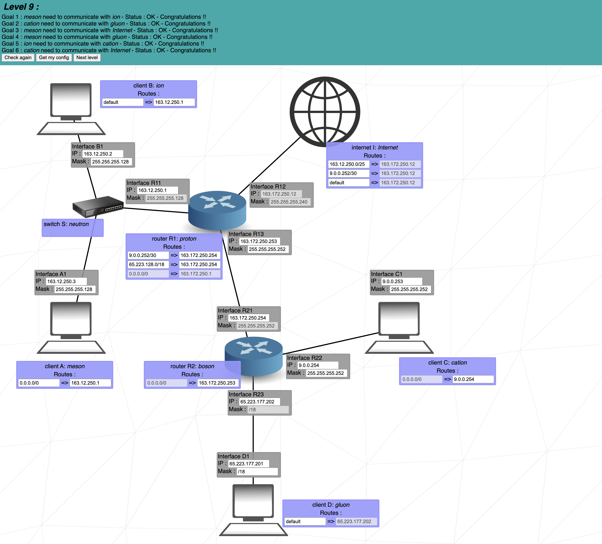

# NetPractice

NetPractice is a general practical exercise to let you discover networking IP addresses and subnet masks.

  

## Key concepts

- TCP/IP
- IPv4
- Subnet Mask
- Switch
- Router
- Routing Table

## Resources
- [Subject](./static/net_practice.pdf)
- [NetPractice](./static/net_practice.1.5.tgz)

